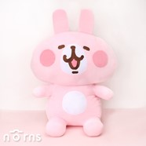

# About me
### I'm a cute girl who loves in research IT and likes to accept challenge.
- 👋 Hi, I’m @ncujouchen.
- 👀 I’m interested in exercising, singing.
- 🌱 I’m currently learning Web Programming.
- 📫 You to reach me by (Email)angel666@g.ncu.edu.tw.
### Nice to meet you😀

### Professional Skills
1. Fashion Illustration
2. Trend Forecasting
3. Textile Design
4. Technical Design
5. Draping/Ruching
6. Flat Pattern Making
7. Construction

### Awards & Citations
* Designer of the Year (2019) Given by the Meadowview Arts Council
* Most Promising Young Designer (2018) Given by the Winslough Academy for the Arts

### Educational Training
**San Dias School of Design**
*Bachelor of Arts in Fashion Design*
* Attended from Aug. 2007 to May 2011
* Graduated magna cum laude with GPA of 3.750
* Best Knitwear Collection, San Dias Student Fashion Show 2010

**Curtin High School**
*Diploma with Academic Distinction*
* Attended from Aug. 2003 to May 2007
* Graduated cum laude with GPA of 3.5
* President, Curtin High Art Club
* Awardee, Excellence in Arts & Design

### Work Experience
**Senior Fashion Designer 23 BAKS Clothing Co. Sept. 2019 to present**
•	Develops and executes designs in line with brand identity and business strategy
•	Collaborates with various teams throughout the design process

## Images

## Links
# [Please visit my homepage](https://ncujouchen.github.io/)
